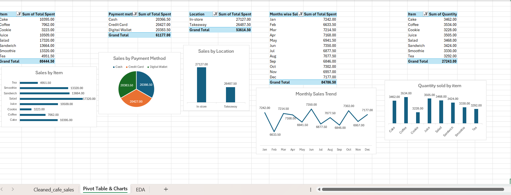

# ☕ Cafe Sales – Exploratory Data Analysis

## Project Overview

This project focuses on performing Exploratory Data Analysis (EDA) on a cleaned Cafe Sales dataset using Microsoft Excel.

The analysis was performed to understand sales performance, transaction patterns, product-wise performance, payment methods, location-wise sales, monthly trends, sales value distribution, and data-quality observations.

The cleaned dataset prepared during Task 1 was used as the foundation for this analysis.

## Objective

The main objectives of this project are:

- Explore the cleaned Cafe Sales dataset
- Calculate key sales KPIs and descriptive statistics
- Analyze sales performance across different dimensions
- Identify trends and patterns in the data
- Analyze transaction value distribution
- Identify important data-quality observations
- Create meaningful charts and visualizations
- Generate business-oriented insights from the data

## 📊 Dataset

The dataset contains cafe transaction-level sales records with the following fields:

- Transaction ID
- Item
- Quantity
- Price Per Unit
- Total Spent
- Payment Method
- Location
- Transaction Date

The original dataset contained missing and invalid values and was cleaned and prepared during Task 1 using Microsoft Excel and Power Query.

## Tools & Techniques

- Microsoft Excel
- Power Query
- PivotTables
- PivotCharts
- Excel Functions
- Descriptive Statistics

## Key Performance Indicators

| KPI | Value |
| Total Sales | ₹88,952 |
| Total Quantity Sold | 30,141 |
| Number of Transactions | 10,000 |
| Average Sales | ₹8.93 |

## Descriptive Statistics

| Metric | Value |
| Median Sales | ₹8 |
| Maximum Sales | ₹25 |
| Minimum Sales | ₹1 |
| Standard Deviation | 6.00 |

The average sales value was ₹8.93, while the median sales value was ₹8. Transaction values ranged from ₹1 to ₹25, with a standard deviation of 6.00, indicating variation in transaction values.

## 🔍 Exploratory Analysis

The following areas were analyzed during the EDA:

### 1. Item-wise Sales Performance

Sales performance was analyzed across different cafe items to identify products contributing the most and least to total sales.

### 2. Payment Method Analysis

Sales were analyzed across Cash, Credit Card, and Digital Wallet to understand the distribution of sales across known payment methods.

### 3. Location-wise Sales Performance

Sales performance was compared between In-store and Takeaway transactions.

### 4. Monthly Sales Trend

Monthly sales from January to December 2023 were analyzed to identify changes and patterns over time.

### 5. Quantity Sold by Item

The quantity sold for each identified item was analyzed to understand sales volume across products.

### 6. Sales Value Distribution

Average, median, minimum, maximum, and standard deviation were used to understand the distribution and variation in transaction values.

### 7. Data Quality Observation

Missing values were observed in categorical fields such as Item, Payment Method, and Location. Where values could not be logically inferred, they were retained as blank to preserve the original sales records.

---

## 💡 Key Insights

### 1. Item-wise Sales Performance

Salad generated the highest sales among the identified items, with total sales of ₹17,320, while Cookie recorded the lowest sales at ₹3,223.

### 2. Payment Method Sales

Credit Card recorded the highest sales among the known payment methods, with total sales of ₹20,427. Cash and Digital Wallet sales were also very close, indicating a relatively balanced distribution across the three known payment methods.

### 3. Location-wise Sales Performance

In-store sales were slightly higher than Takeaway sales, with sales of ₹27,127 and ₹26,487.50 respectively. The difference was relatively small, indicating similar sales performance across both locations.

### 4. Monthly Sales Trend

Monthly sales remained relatively stable from January to December 2023. Sales were highest in June at ₹7,350 and lowest in February at ₹6,633.50.

### 5. Sales Value Distribution

The average sales value was ₹8.93, while the median sales value was ₹8, with transaction values ranging from ₹1 to ₹25 and a standard deviation of 6.00, indicating variation in transaction values.

### 6. Data Quality Insight

Some records contained missing values in categorical fields such as Item, Payment Method, and Location. These values were retained as blank where they could not be logically inferred, preserving the original sales records for analysis.

### 7. Date-wise Data Observation

Some transactions had dates before January 1, 2023. These records were retained in the dataset but excluded from the January–December 2023 monthly trend visualization to keep the time-based analysis focused on 2023.

---

## 📊 Visualizations

The EDA workbook includes the following visualizations:

- Sales by Item
- Sales by Payment Method
- Sales by Location
- Monthly Sales Trend
- Quantity Sold by Item

### EDA Visualizations

## 👤 Author

**Prachi Vaishkiyar**  

Data Analyst Intern | Aspiring Data Analyst
#DataAnalytics #ExploratoryDataAnalysis #SWYNEXTechnologies
